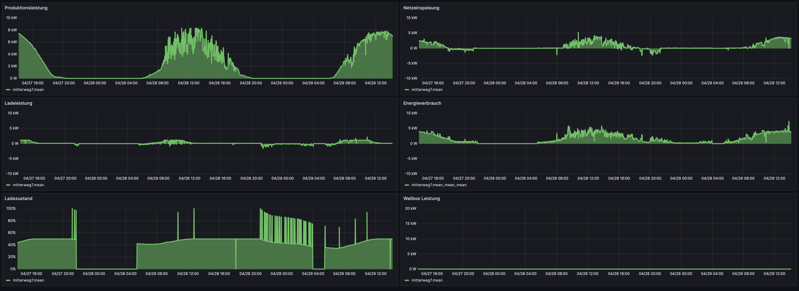
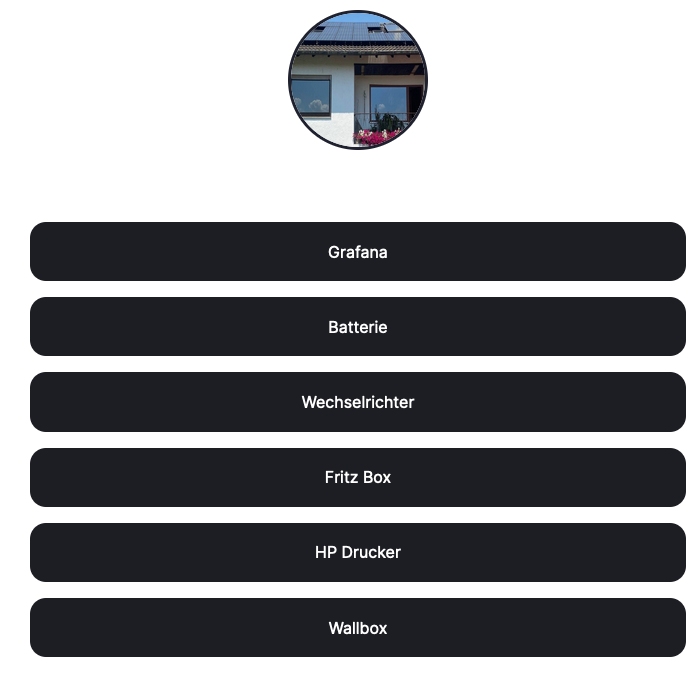

# Weberhome

Visualize solar panel data. Automatic overproduction charging. 

Equipment:

- Fronius Symo
- VARTA ELEMENT BACKUP
- Tinkerforge WARP 2 Pro

Contents:

- Service to save solar panel and wallbox data to influxdb and visualize it with Grafana.
- Service to control WARP 2 Pro to allow for EV charging when solar power is available.
- Link Tree website for convenience.

## Visualisation with Grafana

## Link tree website

